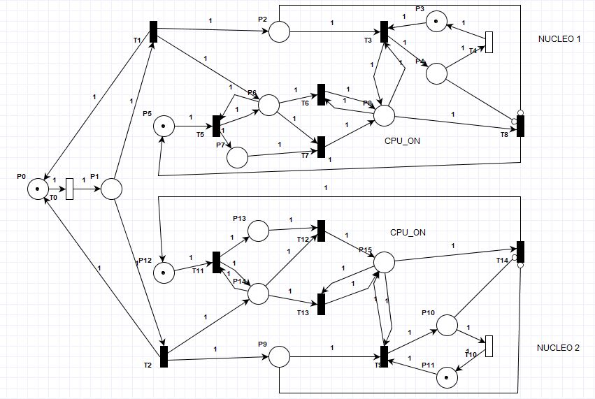
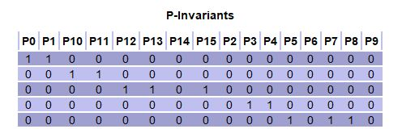
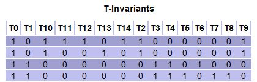
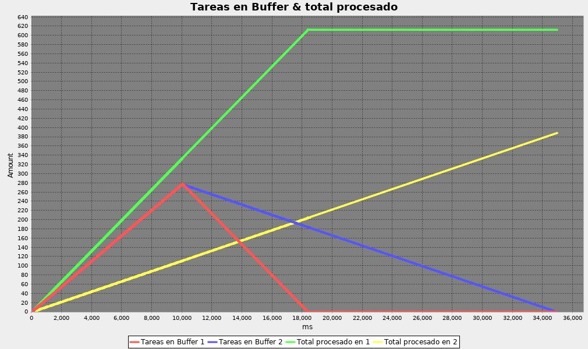
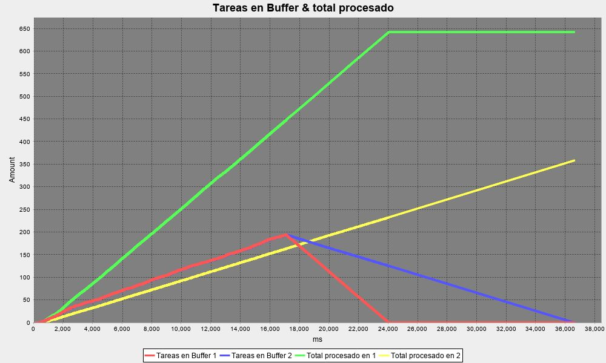

# Dual-core processor using a Petri Net
A dual-core processor simulator implemented using petri net and its generalized equation. It is based on a single core processor expanded into 2 cores. A petri net was used as a technique to design this reactive system preventing deadlocks and such. A concurrency monitor was implemented to use a single server shot policy helping prevent race conditions. 

# System model

# Conflict and policy resolution

Since it isn't implemented in the petri net model, it was hardcoded in the following manner: Before firing the transition that assign's the buffer. It checks the size of its buffer to determine which will transition to fire. In case of having the same amount of jobs, it will by default sent it to buffer 1.

# Invariant analysis

# Considerations 

## Results
They will vary due to the machines hardware which runs the program and JVMs internal code. 

For example, if we set one core to be 3 times faster than the other (30ms vs 60ms) in our program and we execute it on different machines ,where there is 1 that cant handle the required threads. We will see the performance will drop. 

- Case AMD FX(tm)-8320 Eight-Core Processor

- Case Processor Intel(R) Core(TM) i5-7200U CPU @ 2.50GHz, 2712 Mhz, 2 Core(s), 4 Logical Processor(s). 

## (implementacion faltante)
El comportamiento segun la semantica de disparo [a,b] es la siguiente: El hilo se duerme por un tiempo para alcanzar el valor de a (en caso de despertarse y ser menor que a) para luego desperatrse y caer dentro del intervalo. Puede suceder que se despierte y debido al comportamiento del sistema (prioridad de los demas hilos o por el mismo comportamiento de la JVM), intenta disparar y se encuentra que ha superado b. En esta situacion el hilo deberia encolarse, es decir, pasar a un estado bloqueado hasta que sea requerido (sensibilizado). 
Sin embargo, esto no sucede porque, por la naturaleza del problema, esto nunca va a suceder ya que la semantica temporal en este caso es de [a.inf].

Por lo tanto para que funcione el comportamiento descripto anteriormente hace falta implementarlo.

Si se utiliza este codigo con un intervalo temporal de, e.g., [1,2] y se despierta pasando la unidad 2, se volvera a dormir segun la cantidad calculada anteriormente.

## Authors
The present work was an assignment done for "Programacion concurrente" in  "Universidad navional de Cordoba - Facultad de ciencias exactas fisicas y naturales" with the following group members:

- Bastida, Lucas Ramiro
- Miranda, Noelia
- Molina, Franco Elías
- Palmiotti, Mauro Agustín

